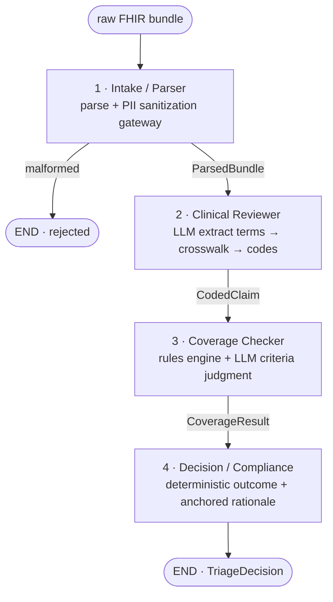

# Prior-Authorization Triage — Multi-Agent PoC

A small crew of LLM agents reasons over a synthetic **FHIR R4** bundle
(Patient, Encounter, Claim, Coverage) and produces a structured
**approve / deny / pend** decision with a human-readable rationale and the
exact policy rules that fired — shown live in a Streamlit dashboard.

**▶️ Live demo:** [huggingface.co/spaces/AkshAt3114/prior-auth-triage](https://huggingface.co/spaces/AkshAt3114/prior-auth-triage)

> ⚠️ **All data in this repository is fabricated.** This is a portfolio
> proof-of-concept. It is **not** a medical device, **not** clinical decision
> support, and must **not** be used with real patient data.

---

## What it is

Prior authorization is the insurer workflow where a requested procedure is
checked against a member's coverage before it's approved. This PoC models that
triage as an explicit **LangGraph state graph** of four agents:

| # | Agent | Deterministic? | LLM role |
|---|-------|----------------|----------|
| 1 | **Intake / Parser** | ✅ fully | none |
| 2 | **Clinical Reviewer** | mapping is deterministic | extracts diagnosis/procedure *terms* from narrative |
| 3 | **Coverage Checker** | rules engine is deterministic | judges whether narrative documents prior-auth *criteria* |
| 4 | **Decision / Compliance** | outcome is deterministic | writes the rationale prose, anchored to fired rules |

Design stance: **the consequential outcome is always deterministic and
reproducible.** The LLM is confined to fuzzy, well-bounded sub-tasks
(reading free text, drafting prose). This keeps the system testable and
auditable while still showcasing agentic orchestration.

---

## Architecture



### Shared state (`TriageState`)

Every node boundary is validated by Pydantic v2. Nodes return partial updates
that LangGraph merges; the `trace` channel uses an additive reducer so each
agent appends its own step.

```
raw_bundle ──▶ parsed ──▶ coded ──▶ coverage ──▶ decision
                 (intake)  (clinical) (coverage)   (decision)
errors[]  ·  trace[AgentStep]  ·  status: running | rejected | complete
```

### PII handling (the sanitization gateway)

The **Intake** node is the single place that touches direct identifiers. It:

1. reads the patient name / MRN / DOB and the raw clinical narrative,
2. registers them with a process-wide **redactor**,
3. emits a *masked* confirmation log (`J*** T. R***`, `***1234`), and
4. maps the patient to an anonymized, stable `subject_uuid` (a `uuid5` over the
   original id) — name / MRN / DOB never enter `ParsedBundle`.

A logging filter then scrubs any registered value from **all** log output, and
the Decision node asserts the final decision payload contains no registered
identifier before emitting it. The raw narrative is kept in state only so the
Clinical Reviewer can read it; it is never sent to the rationale LLM.

---

## Quick start

This project uses [`uv`](https://docs.astral.sh/uv/) and Python 3.11+.

```bash
# 1. Install uv (if needed): https://docs.astral.sh/uv/getting-started/
# 2. Create the env and install
uv venv --python 3.11
uv pip install -e ".[dev]"

# 3. Run the dashboard (works out of the box in offline Demo mode — no API key)
uv run streamlit run app/dashboard.py
```

Then pick a sample bundle in the sidebar and click **Run triage**.

> On some macOS setups `SYSTEM_VERSION_COMPAT` makes the OS report version
> `10.16`, which can push `uv` to build `cryptography` from source. If install
> fails there, prefix the install with `SYSTEM_VERSION_COMPAT=0`.

### Run the tests

```bash
uv run pytest
```

The suite mocks the LLM (`tests/fixtures/mock_llm.py`) and never calls a real
API. It covers the parser, the crosswalk, the rules engine, each agent, and the
graph end-to-end across all sample cases.

---

## LLM provider setup

The provider sits behind a single factory, `pa_triage.llm.get_llm()`, selected
by the `LLM_PROVIDER` env var. Copy `.env.example` to `.env` and fill in.

### Gemini (default — Google AI Studio free tier, no billing)

```env
LLM_PROVIDER=gemini
GOOGLE_API_KEY=your-free-key      # https://aistudio.google.com/app/apikey
GEMINI_MODEL=gemini-2.5-flash
```

### Ollama (fully local, no API key)

```bash
# install from https://ollama.com, then:
ollama pull qwen2.5
```

```env
LLM_PROVIDER=ollama
OLLAMA_MODEL=qwen2.5
OLLAMA_BASE_URL=http://localhost:11434
```

### Demo mode (no setup at all)

The dashboard defaults to an offline **heuristic stand-in**
(`pa_triage.demo_llm.HeuristicLLM`) so anyone can click through the pipeline
with zero configuration. It is **not** an LLM and its outputs are illustrative —
switch the sidebar to your configured provider for real reasoning.

---

## Sample cases (`data/samples/`)

| File | Scenario | Expected outcome |
|------|----------|------------------|
| `01_approve_clean.json` | Covered service, no prior auth needed | **approve** |
| `02_deny_exclusion.json` | Cosmetic blepharoplasty (policy exclusion) | **deny** |
| `03_pend_missing_info.json` | MRI needs prior auth; criteria undocumented | **pend** |
| `04_prior_auth_required.json` | MRI needs prior auth; criteria documented | **approve** |
| `05_deny_not_covered.json` | Acupuncture — not a covered service | **deny** |

The mock **crosswalk** (`data/crosswalk.json`) and **policy ruleset**
(`data/policy.json`) are plain JSON you can edit freely.

---

## Project layout

```
src/pa_triage/
  config.py            # settings (env / .env)
  llm.py               # get_llm() provider factory
  demo_llm.py          # offline heuristic stand-in (clearly labeled)
  logging_utils.py     # PII redactor + masked logging
  crosswalk.py         # ICD-10/CPT loader + deterministic matcher
  policy.py            # policy loader + pure rules engine
  graph.py             # LangGraph wiring
  pipeline.py          # run_triage / stream_triage entrypoints
  models/              # fhir.py · domain.py · state.py (Pydantic)
  agents/              # intake · clinical · coverage · decision
app/dashboard.py       # Streamlit UI
data/                  # crosswalk.json · policy.json · samples/
tests/                 # parser · crosswalk · rules · agents · e2e
```

---

## Design decisions & tradeoffs

- **Hand-rolled FHIR subset** instead of the `fhir.resources` library — lighter
  and legible, at the cost of not being a full R4 validator. Unknown fields are
  tolerated so realistic bundles parse.
- **Deterministic outcome, LLM-written rationale.** The approve/deny/pend result
  is computed by the rules engine; the LLM only writes the explanation and is
  instructed to reference *only* the rules that fired. The structured
  `fired_rules` are always shown alongside the prose as the source of truth.
- **LLM scoped tightly.** Code mapping (crosswalk) and policy evaluation are
  pure functions; the LLM handles only narrative extraction and criteria
  judgment. Both are mocked in tests for full determinism.
- **Dependency injection.** Agents are built by factories that take the LLM /
  crosswalk / policy, so the graph wires real ones and tests wire fakes.

---

## Limitations (honest)

- **Synthetic, tiny, and illustrative.** The crosswalk and policy contain a
  handful of codes; this is not a real payer policy or a complete code set.
- **Not a FHIR validator.** Only the four resource types used here are modeled,
  and loosely; many valid bundles would parse but aren't exercised.
- **No real clinical or coverage authority.** Outcomes reflect the toy ruleset,
  not any actual medical-necessity guidance.
- **The metrics panel is illustrative.** The "manual vs automated" comparison
  uses an assumed manual-review time and is explicitly labeled as such — it is
  not a benchmark.
- **LLM judgment can be wrong.** Prior-auth criteria assessment depends on the
  model reading the narrative; it can mis-judge. The deterministic outcome
  bounds the blast radius, but a human-in-the-loop would be required for any
  real use.
- **No persistence, auth, or multi-claim batching.** Single-claim, in-memory.

---

## License

MIT. Synthetic data only.
